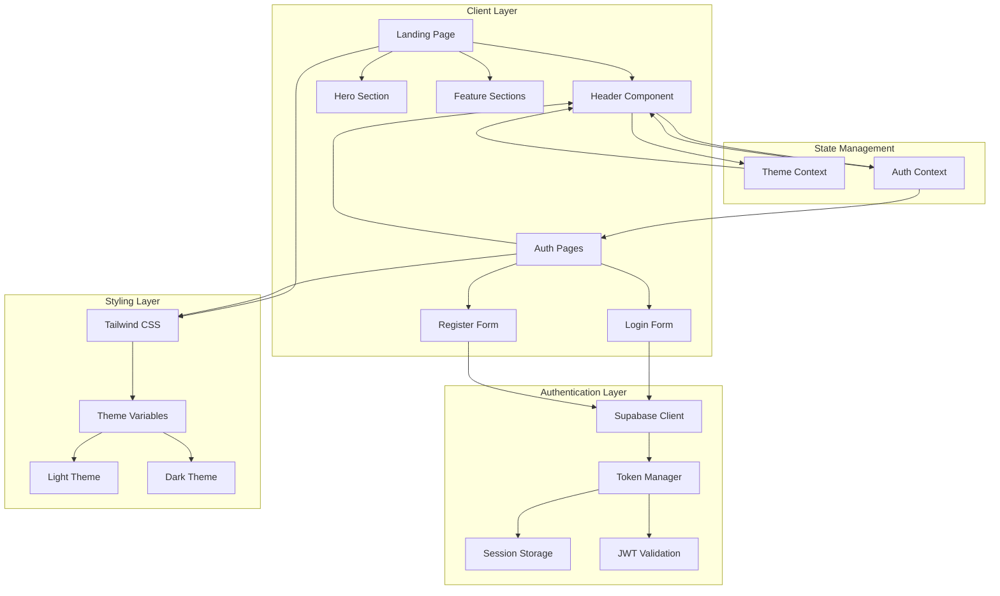
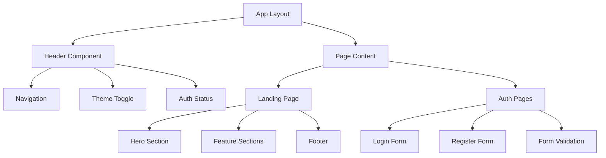

# Design Document: Landing Page Enhancement

## Overview

This design outlines the enhancement of the ToolkitHub landing page to achieve a professional SaaS-style interface with stable functionality. The solution focuses on three core areas: implementing robust token-based authentication with a stable theme toggle, polishing the landing page visual design, and modernizing the authentication UI.

The design leverages Next.js 15's App Router capabilities, Tailwind CSS for consistent styling, and Supabase Auth for secure authentication. The approach emphasizes minimal accent design, professional SaaS aesthetics, and seamless user experience across all devices.

## Architecture

### System Architecture



### Component Hierarchy



## Components and Interfaces

### Header Component Interface

```typescript
interface HeaderProps {
  className?: string;
}

interface AuthState {
  user: User | null;
  session: Session | null;
  loading: boolean;
}

interface ThemeState {
  theme: 'light' | 'dark' | 'system';
  setTheme: (theme: 'light' | 'dark' | 'system') => void;
  resolvedTheme: 'light' | 'dark';
}
```

### Theme Toggle Component

The theme toggle will use the `next-themes` library for robust theme management:

```typescript
interface ThemeToggleProps {
  className?: string;
  size?: 'sm' | 'md' | 'lg';
}

// Implementation approach:
// 1. Use next-themes ThemeProvider at app root
// 2. Implement custom toggle with smooth transitions
// 3. Persist theme preference in localStorage
// 4. Handle system preference detection
// 5. Prevent flash of incorrect theme (FOIT)
```

### Authentication Components

```typescript
interface AuthFormProps {
  mode: 'login' | 'register';
  onSuccess?: (user: User) => void;
  onError?: (error: string) => void;
}

interface FormValidationState {
  email: {
    value: string;
    error: string | null;
    touched: boolean;
  };
  password: {
    value: string;
    error: string | null;
    touched: boolean;
  };
  confirmPassword?: {
    value: string;
    error: string | null;
    touched: boolean;
  };
}
```

### Landing Page Sections

```typescript
interface HeroSectionProps {
  title: string;
  subtitle: string;
  ctaText: string;
  ctaHref: string;
}

interface FeatureSectionProps {
  features: Array<{
    title: string;
    description: string;
    icon: React.ComponentType;
  }>;
}
```

## Data Models

### Authentication Data Models

```typescript
// Supabase User Extension
interface ExtendedUser extends User {
  user_metadata: {
    full_name?: string;
    avatar_url?: string;
  };
}

// Session Management
interface SessionData {
  access_token: string;
  refresh_token: string;
  expires_at: number;
  user: ExtendedUser;
}

// Auth Context State
interface AuthContextType {
  user: ExtendedUser | null;
  session: Session | null;
  loading: boolean;
  signIn: (email: string, password: string) => Promise<AuthResponse>;
  signUp: (email: string, password: string) => Promise<AuthResponse>;
  signOut: () => Promise<void>;
  refreshSession: () => Promise<void>;
}
```

### Theme Data Models

```typescript
interface ThemeConfig {
  themes: Array<'light' | 'dark' | 'system'>;
  defaultTheme: 'light' | 'dark' | 'system';
  storageKey: string;
  attribute: 'class' | 'data-theme';
  enableSystem: boolean;
  disableTransitionOnChange: boolean;
}

interface ThemeContextType {
  theme: string | undefined;
  setTheme: (theme: string) => void;
  resolvedTheme: string | undefined;
  themes: string[];
  systemTheme: string | undefined;
}
```

### Form Validation Models

```typescript
interface ValidationRule {
  required?: boolean;
  minLength?: number;
  maxLength?: number;
  pattern?: RegExp;
  custom?: (value: string) => string | null;
}

interface FieldValidation {
  value: string;
  error: string | null;
  touched: boolean;
  rules: ValidationRule[];
}

interface FormState {
  fields: Record<string, FieldValidation>;
  isValid: boolean;
  isSubmitting: boolean;
  submitError: string | null;
}
```

## Correctness Properties

*A property is a characteristic or behavior that should hold true across all valid executions of a system-essentially, a formal statement about what the system should do. Properties serve as the bridge between human-readable specifications and machine-verifiable correctness guarantees.*

### Authentication State Properties

**Property 1: Authentication State Consistency**
*For any* authentication state change (login, logout, session expiry), the Header_Component should immediately reflect the new state across all pages without requiring page refresh, and all authentication tokens should be properly managed in secure storage.
**Validates: Requirements 1.1, 1.2, 1.3, 1.5**

**Property 2: Session Persistence**
*For any* valid authentication session, the Token_Auth should persist across browser sessions using secure storage and automatically restore the authenticated state on application reload.
**Validates: Requirements 1.4**

### Theme Management Properties

**Property 3: Theme Toggle Functionality**
*For any* theme selection (light, dark, system), the Theme_Toggle should switch modes smoothly, apply all appropriate styles without visual breaks, and maintain the selection across all pages and browser sessions.
**Validates: Requirements 2.1, 2.2, 2.3, 2.5**

**Property 4: Theme Loading Consistency**
*For any* page load, the Theme_Toggle should apply the previously selected theme immediately without flash of incorrect theme (FOIT) and complete all transitions within 300 milliseconds.
**Validates: Requirements 2.4, 8.3**

### Landing Page Design Properties

**Property 5: Visual Consistency**
*For any* landing page section, the spacing, typography, and visual hierarchy should follow consistent patterns with proper semantic HTML heading structure.
**Validates: Requirements 3.1, 3.2**

**Property 6: Responsive Design Behavior**
*For any* viewport size (mobile, tablet, desktop), the Responsive_Design should maintain full functionality, readability, appropriate touch target sizing, and effective space utilization while adapting smoothly to orientation changes.
**Validates: Requirements 3.4, 5.1, 5.2, 5.3, 5.4, 5.5**

### Authentication UI Properties

**Property 7: CSS Module Elimination**
*For any* authentication page component, the codebase should contain no CSS module imports and use Tailwind CSS exclusively for all styling.
**Validates: Requirements 4.1**

**Property 8: Auth Page Structure Consistency**
*For any* authentication page visit, the page should display consistent Header_Component and footer elements with seamless Supabase_Auth integration.
**Validates: Requirements 4.2, 4.5**

**Property 9: Form Validation Completeness**
*For any* form interaction (input, blur, submit), the Auth_Pages should provide immediate validation feedback, display specific actionable error messages for invalid data, preserve form data during errors, and show appropriate loading states during processing.
**Validates: Requirements 4.3, 4.4, 7.1, 7.2, 7.3, 7.4**

**Property 10: Authentication Flow Success**
*For any* successful authentication, the Auth_Pages should redirect users smoothly to their intended destination without data loss.
**Validates: Requirements 7.5**

### Header Consistency Properties

**Property 11: Cross-Page Header Behavior**
*For any* page navigation, the Header_Component should maintain identical layout, functionality, authentication state, and theme selection while remaining stable without unnecessary re-rendering.
**Validates: Requirements 6.1, 6.2, 6.3, 6.4, 6.5**

### Performance Properties

**Property 12: Loading Performance**
*For any* page load, critical content should render within 2 seconds, the Header_Component should become interactive within 1 second, and authentication processes should display appropriate loading indicators.
**Validates: Requirements 8.1, 8.2, 8.4**

**Property 13: Progressive Asset Loading**
*For any* image or asset loading on landing sections, progressive loading techniques should be used to maintain perceived performance.
**Validates: Requirements 8.5**

## Error Handling

### Authentication Error Handling

**Token Expiration Management:**
- Implement automatic token refresh before expiration
- Handle refresh token rotation securely
- Graceful fallback to login when refresh fails
- Clear invalid tokens from storage immediately

**Network Error Handling:**
- Retry logic for transient network failures
- Offline state detection and user notification
- Queue authentication requests during network issues
- Graceful degradation of auth-dependent features

**Validation Error Handling:**
- Real-time field validation with debouncing
- Clear, actionable error messages
- Form state preservation during errors
- Accessibility-compliant error announcements

### Theme Error Handling

**Theme Loading Failures:**
- Fallback to system theme preference
- Graceful handling of corrupted theme storage
- Default theme application when preferences unavailable
- Prevention of infinite theme switching loops

**CSS Loading Errors:**
- Fallback styles for critical UI elements
- Progressive enhancement approach
- Graceful degradation for unsupported features
- Error boundary for theme-related crashes

### Responsive Design Error Handling

**Viewport Detection Issues:**
- Fallback breakpoints for unsupported devices
- Graceful handling of orientation change failures
- Default layouts for unknown screen sizes
- Progressive enhancement for touch capabilities

## Testing Strategy

### Dual Testing Approach

The testing strategy employs both unit testing and property-based testing to ensure comprehensive coverage:

**Unit Tests:**
- Focus on specific examples and edge cases
- Test integration points between components
- Validate error conditions and boundary cases
- Verify accessibility compliance
- Test specific user interaction flows

**Property-Based Tests:**
- Verify universal properties across all inputs
- Test authentication flows with randomized data
- Validate theme switching across random page combinations
- Test responsive behavior across random viewport sizes
- Verify form validation with generated input combinations

### Property-Based Testing Configuration

**Testing Library:** Fast-check for TypeScript/JavaScript property-based testing
**Test Configuration:**
- Minimum 100 iterations per property test
- Each property test references its design document property
- Tag format: **Feature: landing-page-enhancement, Property {number}: {property_text}**

**Test Categories:**

1. **Authentication Property Tests:**
   - Random user credentials and session states
   - Various token expiration scenarios
   - Cross-browser session persistence testing

2. **Theme Property Tests:**
   - Random theme selections and page combinations
   - Various viewport sizes and orientation changes
   - Theme persistence across random navigation patterns

3. **Form Validation Property Tests:**
   - Generated invalid input combinations
   - Random form interaction sequences
   - Various error and success scenarios

4. **Responsive Design Property Tests:**
   - Random viewport dimensions and device types
   - Generated content lengths and structures
   - Various orientation and zoom combinations

### Unit Testing Focus Areas

**Authentication Unit Tests:**
- Specific login/logout scenarios
- Token refresh edge cases
- Error message accuracy
- Redirect behavior validation

**Theme Unit Tests:**
- Specific theme transition scenarios
- CSS class application verification
- Storage mechanism testing
- System preference detection

**Form Unit Tests:**
- Specific validation rules
- Error message content
- Loading state timing
- Accessibility features

**Responsive Unit Tests:**
- Specific breakpoint behavior
- Touch target sizing
- Navigation usability
- Content readability

### Integration Testing

**End-to-End Scenarios:**
- Complete authentication flows
- Theme persistence across sessions
- Cross-page navigation consistency
- Form submission and error handling
- Responsive behavior validation

**Performance Testing:**
- Page load time measurements
- Theme transition timing
- Authentication process duration
- Asset loading optimization

### Accessibility Testing

**WCAG Compliance:**
- Keyboard navigation testing
- Screen reader compatibility
- Color contrast validation
- Focus management verification
- Error announcement testing

**Testing Tools:**
- axe-core for automated accessibility testing
- Manual keyboard navigation testing
- Screen reader testing with NVDA/JAWS
- Color contrast analyzers
- Focus indicator validation